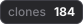
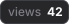
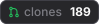
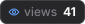
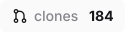
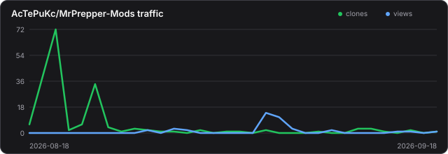
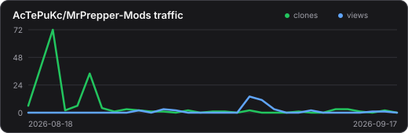

# SVG Preview

This page is a small playground for badge and chart styles before changing the production assets.

The metric examples use `MrPrepper-Mods` because it has enough traffic data to make the preview useful. Values are regenerated by the normal metrics workflow.

For the full supported/upstream feature matrix and stable embed syntax, see [`docs/BADGES.md`](docs/BADGES.md).

## Current production badges

 

```md
 
```

## Icon badges - secondary

 

```md
 
```

## Icon badges - outline

 

```md
 
```

## Larger / louder variants

 

```md
 
```

The destructive version is intentionally excessive. It is here to test the design system, not because repository views are an emergency.

## Config-driven badge recipes

These examples are generated from [`preview_badges.json`](preview_badges.json). The JSON is our local equivalent of a small subset of the ShieldCN builder: edit a recipe, run the workflow, and the local renderer writes the SVG.

External icons are resolved **at build time** from `simple-icons` and `react-icons`. No icon CDN or badge service is contacted when a README displays the finished SVG.

### Construction Zone - Lucide icon

ShieldCN-style source idea:

```text
/badge/Construction%20Zone-abcde3.svg?size=xs&font=geist&logo=lu%3AConstruction&gradient=FFEA61%2CFFD400%2CFFDD3C%2CFFEA61&gap=10
```

Local generated preview:


```md

```

Icon identifier: `lu:Construction`

The recipe keeps the upstream-style icon identifier `lu:Construction`; `src/resolve_icons.mjs` resolves it from React Icons during the workflow.

### Split AI badge - React Icons


```md

```

Icon identifier: `ri:FaRobot`

This uses `ri:FaRobot`, which is resolved from the appropriate React Icons pack automatically.

### Brand badge - Simple Icons


```md

```

Brand identifier: `claude`

The recipe only says `"brand": "claude"`. The build step searches Simple Icons by slug/title and supplies the icon path and default brand color. There is no hand-maintained list of brands in `repo-metrics`.

### Builder kitchen sink

The following intentionally excessive badge exercises the controls from a ShieldCN builder-style URL in one recipe:


```md

```

Brand identifier: `claude`

It combines `destructive`, `xs`, `split`, full label opacity, a gradient, the Claude brand icon, custom height/font/padding/icon dimensions, `gap`, `labelGap`, and a status dot.

## Traffic chart

### Full



```md

```

### Compact



```md

```

## Notes

- The code blocks below each rendered asset show the exact Markdown used by this page, so examples can be copied without opening the source view.
- `preview_badges.json` contains the human-readable experimental badge recipes.
- `src/badge_renderer.py` contains `BadgeConfig` and the generic SVG badge renderer.
- `src/resolve_icons.mjs` resolves requested Simple Icons, React Icons and Lucide identifiers at build time.
- Small repo-specific icons such as clone and eye remain local aliases because they require no dependency lookup.
- No external icon, badge, chart, CDN or rendering service is required at display time.
- Preview metric assets are generated from the same tracked JSON as the production assets.
- Once a style is chosen, it can replace the production badge renderer without changing existing README URLs.
